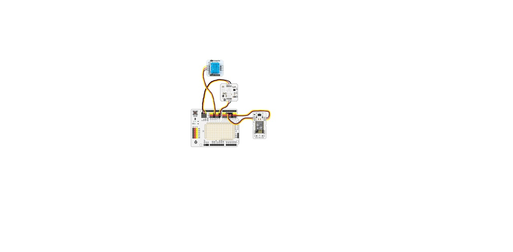

## Home weather station

This is a weather station realization for RTU MIREA project.

### Prerequisites:
1. Python 3.6+ version
2. Docker-compose
3. Personal MQTT Broker


### Our station:
- Iskra Uno 
- Troyka DHT11 
- Troyka барометр V2
- Troyka wifi slot

`Tools -> Board -> Generic ESP8266 Module`

### Generic ESP8266 Module Setting:
- Crystal Frequency: 26 MHz
- Flash mode: DIO
- Flash Frequency: 40 MHz
- Reset method: dtr
- Upload speed: 115200
- Flash Size: 512 KB(FS: 64KB, OTA:~214KB)
- MMU: 32KB cache + 32KB IRAM (balanced)
- CPU Frequency: 80 MHz



### How to build:
1. Start your own MQTT broker (We use mosquitto mqtt)
2. `docker-compose up`
3. `python3 server.py`
4. Now you just need to send the data to mqtt broker

### Room for improvements
- English translation. I am pretty lazy for this. 
> If you REALLY need translation: send me an email at ```chereshnev.n.s@gmail.com```

### Code authors
+ https://github.com/AlexandrLevkovets: Alexander, author of php server, mysql database and the site
+ https://github.com/guessitsok: Dmitry, author program for arduino model
+ https://github.com/SSkimos: Nikita, author of mqtt-broker and python server